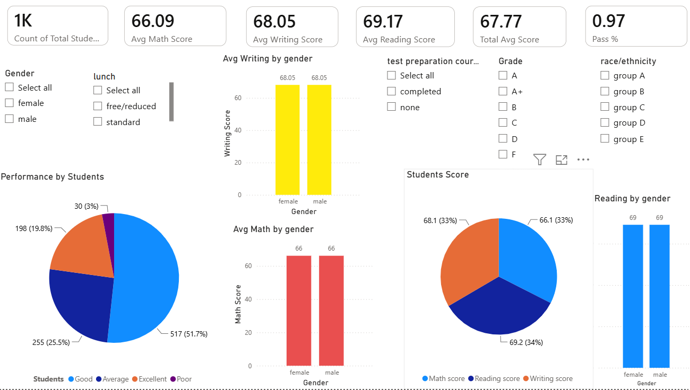

# 📊 Student Performance Dashboard

---

## 📌 Project Overview

This Power BI dashboard analyzes student performance using interactive visualizations. It provides insights into students' academic performance based on gender, race/ethnicity, parental education, lunch type, and test preparation course.

---

## 📋 Project Details

| Category | Details |
|----------|----------|
| 📊 Tool | Power BI |
| 📂 Dataset | Student Performance Dataset |
| 🎯 Domain | Education Analytics |
| 👨‍💻 Developed By | Vishwa R |

---

## 🛠️ Tools Used

- Power BI
- Microsoft Excel

---

## 📈 Dashboard Features

- 📌 Total Students
- 📌 Average Math Score
- 📌 Average Reading Score
- 📌 Average Writing Score
- 📌 Overall Average Score
- 📌 Pass Percentage
- 📌 Interactive Filters (Gender, Lunch, Grade, Race/Ethnicity, Test Preparation)
- 📌 KPI Cards
- 📌 Pie Charts
- 📌 Bar Charts
- 📌 Slicers

---

## 💡 Key Insights

- Female students performed better in reading and writing.
- Students who completed the test preparation course achieved higher average scores.
- Interactive filters make it easy to compare different student groups.

---

## 📸 Dashboard Preview

---

## 🎥 Demo Video

▶️ [Watch Dashboard Demo](https://github.com/vishwaofficial1511-jpg/student-performance-dashboard/blob/main/dashboard-demo.mp4)

---

## 📂 Repository Contents

- 📄 StudentPerformance.pbix
- 📊 StudentsPerformance.csv
- 🖼️ dashboard.png
- 🎥 dashboard-demo.mp4
- 📝 README.md

---

## 👨‍💻 Author

**Vishwa R**

B.Tech Artificial Intelligence and Data Science Student

### Skills

- Python
- SQL
- Power BI
- NumPy
- Pandas
- Matplotlib

---

⭐ If you found this project useful, consider giving it a Star!
